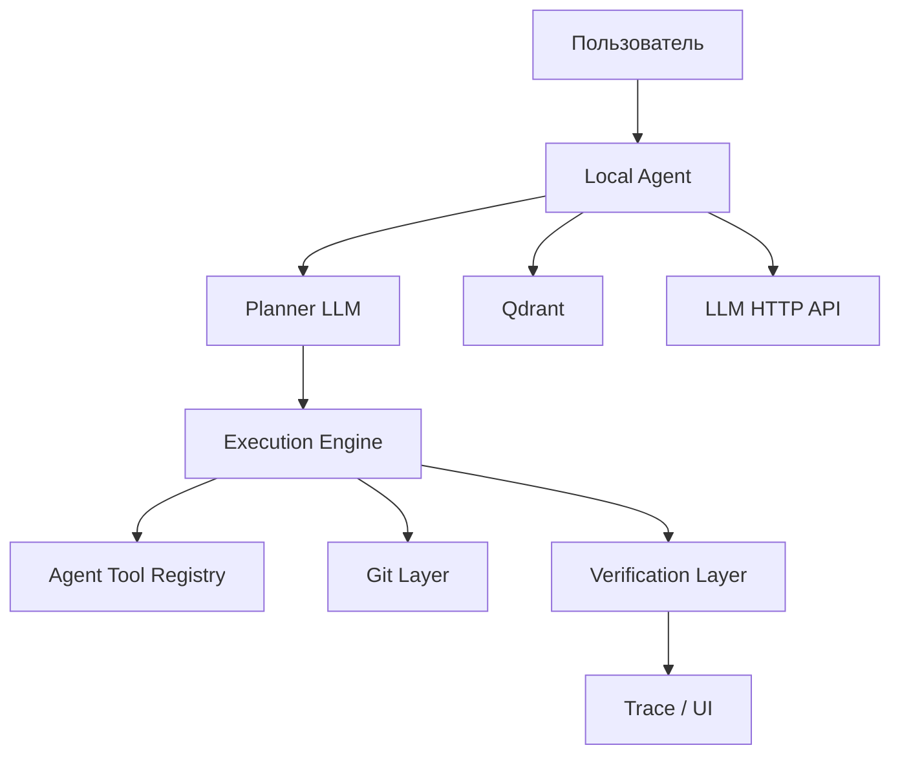
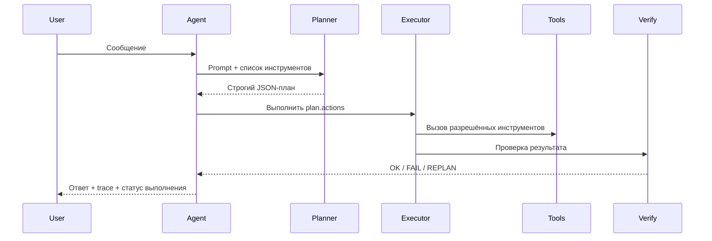
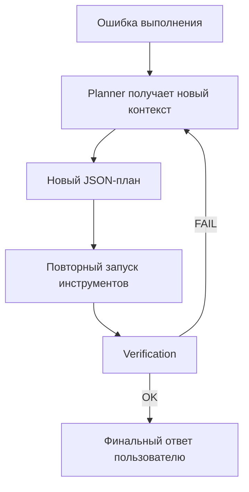
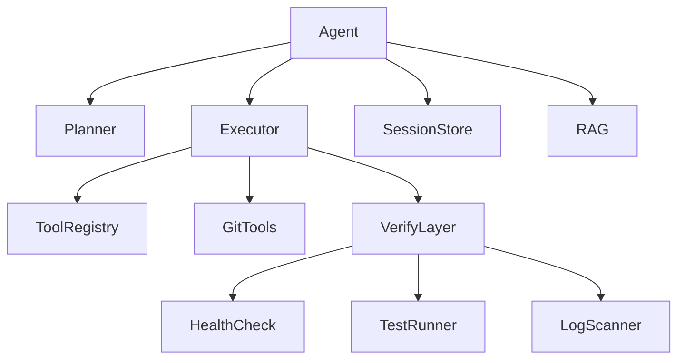

# Cartoon Agent --- Актуальная архитектура

## 1. Общая схема

Ключевые правила:

- Агент запускается локально как Python-процесс.
- LLM не имеет прямого доступа к файлам проекта.
- Любой доступ к workspace идёт только через инструменты агента.
- Вызов инструментов идёт только через planner и executor.
- Детерминированные команды временно исключены из архитектуры.

## 2. Последовательность выполнения

## 3. Self-fix loop

## 4. Текущие архитектурные приоритеты

### Фаза 1 --- Рабочий Planner/Executor

- Planner возвращает только JSON.
- Инструменты вызываются только по плану planner.
- AgentTools является единственной точкой доступа к файлам проекта.
- Trace событий передаётся в UI.
- Git-интеграция используется из executor/tool layer.

### Фаза 2 --- Loop и verification

- Перепланирование после ошибок выполнения.
- Verification layer после executor.
- Базовый self-fix workflow.
- Smoke-проверка результата.

### Фаза 3 --- Asset pipeline

- Генерация ассетов через агент.
- Загрузка только с whitelist-доменов.
- Трансформация ассетов внутри agent pipeline.
- Unreal import helper как инструмент агента.

### Фаза 4 --- Саморасширение

- Component registry.
- Регистрация новых модулей в агенте.
- Реиспользование существующих инструментов.
- Feature-branch workflow для расширений.

## 5. Модульная схема

## 6. Нефункциональные требования

- Полная аудируемость действий агента.
- Никаких silent-modifications.
- Все файловые операции ограничены workspace root.
- LLM не читает и не пишет файлы напрямую.
- Все изменения в проекте выполняются только через агент.
- Любые внешние загрузки проходят через whitelist и через agent layer.
- Агент работает локально, а не внутри Docker-контейнера.

## 7. Критерии готовности

Система считается рабочей для текущего этапа, если:

- planner стабильно выдаёт валидный JSON-план;
- executor корректно вызывает инструменты из `AgentTools`;
- пользовательский запрос может приводить к реальному tool execution;
- ошибки исполнения могут инициировать replan;
- trace доступен пользователю;
- agent остаётся единственным файловым посредником между LLM и проектом.

## 8. Параметры среды

- Agent runtime: локальный Python-процесс (`uvicorn main:app`)
- Agent HTTP: `http://127.0.0.1:8000`
- Agent WebSocket: `ws://127.0.0.1:8000/ws`
- Workspace host path: `/home/roman/Документы/Unreal Projects/мульт`
- LLM endpoint: `http://localhost:8080/v1/chat/completions`
- Qdrant endpoint: `http://localhost:6333`
- Docker: допустим только для вспомогательных сервисов, агент в Docker не запускается
- LLM service не должен иметь прямой mount workspace и не должен работать с файлами напрямую

## 9. Стартовый контекст для нового чата

Нужна реализация актуальной локальной Architecture B:

- planner-only tool execution;
- локальный agent как единственная точка доступа к файлам;
- execution loop с replan;
- verification layer;
- trace layer;
- asset pipeline позже, но тоже только через agent.
